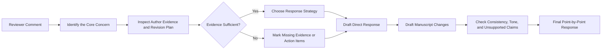

<div align="center">

# Peer Review Response Writer

### A Skill for drafting rigorous, evidence-grounded, point-by-point responses to academic peer-review comments.

Transform reviewer comments, revision plans, and manuscript evidence into clear, professional, point-by-point responses—without inventing experiments, results, or manuscript changes.


[Overview](#overview) · [Features](#key-features) · [Quick Start](#quick-start) · [Examples](#example-prompts) · [中文说明](#中文说明)

</div>

---

## Overview

**Awesome Trans Response Letter** is a reusable ChatGPT Skill for preparing academic response letters, rebuttals, and revision notes.

It is designed for authors who need to convert fragmented materials—such as reviewer comments, draft ideas, experiment plans, equations, manuscript excerpts, and revision locations—into a coherent response that:

- identifies the reviewer's real concern;
- answers that concern directly and respectfully;
- distinguishes explanation from actual manuscript revision;
- connects every claim to evidence supplied by the author;
- provides publication-ready English when requested; and
- preserves the technical meaning of the manuscript.

This is **not** a generic paraphrasing prompt. The Skill follows a structured academic-response workflow and applies explicit safeguards against unsupported claims.

---

## Key Features

### 1. Reviewer-concern diagnosis

The Skill first determines what the reviewer is actually asking for, such as:

- clearer motivation or novelty;
- stronger mathematical justification;
- improved physical or model interpretability;
- additional experiments, ablations, or baselines;
- complexity and runtime analysis;
- fairer comparison settings;
- clarification of assumptions, notation, or implementation details;
- improved figures, tables, or qualitative visualization; or
- toned-down claims and clearer limitations.

### 2. Point-by-point response construction

Each response is organized around a reliable logic chain:

> **Acknowledge → Diagnose → Answer → Support → Revise → Locate**

This helps avoid common weaknesses such as long introductions, vague promises, defensive wording, and responses that never directly resolve the comment.

### 3. Evidence-grounded writing

The Skill must not invent:

- experiments that were not performed;
- numerical results that were not supplied;
- equations, theorems, datasets, baselines, or references;
- page, section, figure, table, or line numbers;
- implementation details that the author did not confirm; or
- manuscript changes that have not actually been made.

When information is missing, the Skill should use an explicit placeholder or action item instead of fabricating a complete answer.

### 4. Separation of response and revision

The output can clearly separate:

- **Response to the reviewer** — explanation and scientific argument;
- **Changes in the manuscript** — what was added, deleted, rewritten, or reorganized;
- **Revised manuscript text** — replacement paragraphs ready for insertion; and
- **Remaining action items** — experiments, figures, citations, or checks still required.

### 5. Strategy-aware replies

The Skill can draft responses under different author positions:

- **Agree** — accept the concern and revise accordingly;
- **Partially agree** — acknowledge the valid part while clarifying scope or assumptions;
- **Respectfully disagree** — explain why the requested interpretation or experiment may not apply, while improving the manuscript to prevent misunderstanding;
- **Already addressed but unclear** — point to the existing content and rewrite it for clarity; or
- **Requires additional evidence** — propose a concrete experiment, analysis, or visualization before drafting a final claim.

### 6. Bilingual academic support

Typical workflows include:

- Chinese reasoning notes → polished English response;
- English reviewer comment → Chinese concern analysis;
- bilingual response-letter drafting;
- IEEE-style technical English polishing; and
- consistency checking between Chinese plans, English replies, and revised manuscript text.

---

## Core Workflow



The Skill should prioritize **scientific correctness and traceability** over rhetorical fluency.

---

## Recommended Inputs

The Skill works best when the user provides the following information.

### Required

1. **Reviewer comment**
2. **Author's intended response or revision plan**

### Strongly recommended

3. Relevant manuscript excerpt, equations, figures, or tables
4. Experiments or analyses already completed
5. New numerical results, if any
6. Exact revision location, if already known
7. Target venue or preferred writing style
8. Desired output language

A useful input template is:

```text
Reviewer comment:
[Paste the complete comment here.]

My current understanding of the concern:
[Optional.]

Planned response:
- ...
- ...

Evidence already available:
- Equation/derivation: ...
- Experiment/result: ...
- Figure/table: ...

Manuscript text related to this comment:
[Paste the relevant excerpt.]

Revision status:
[Completed / Planned / Not yet decided]

Output requirements:
[Language, tone, length, journal style, and desired sections.]
```

---

## Standard Output Format

A recommended point-by-point format is:

```markdown
### Comment X

> [Original reviewer comment]

**Response:**  
Thank you for this insightful comment. [Direct answer to the core concern...]

[Technical explanation, evidence, derivation, experiment, or clarification...]

**Changes in the manuscript:**  
We have revised Section [X] to [describe the actual change].

**Revised text:**  
> [Exact text added to or revised in the manuscript.]

**Location:**  
Section [X], Page [XX], Lines [YY–ZZ].
```

When the exact location is unknown, the Skill should use placeholders such as:

```text
Section [TO BE CONFIRMED], Page [XX], Lines [YY–ZZ]
```

rather than inventing a location.

---

## Quick Start

### 1. Clone or download the repository

```bash
git clone https://github.com/Hao-Thunder/Awesome-Trans-Response-Letter.git
cd Awesome-Trans-Response-Letter
```

You can also download the repository as a ZIP archive.

### 2. Import the Skill

Import the Skill folder or packaged ZIP into a ChatGPT environment that supports custom Skills. The Skill entrypoint should be the repository's `SKILL.md` file.

### 3. Invoke it with a concrete task

```text
Use Awesome Trans Response Letter to analyze the reviewer comment below.

First identify the core concern and evaluate whether my planned response
fully addresses it. Then draft:
1. a polished English response;
2. the corresponding manuscript changes;
3. a revised paragraph for the paper; and
4. a list of unsupported claims or missing evidence.

Reviewer comment:
...

My planned response:
...
```

---

## Example Prompts

### Example 1: Respond to one technical comment

```text
Use this Skill to prepare a response to the following reviewer comment.

Requirements:
- Explain the reviewer's core concern first.
- Use a respectful but confident academic tone.
- Do not invent experimental results.
- Separate the reviewer response from the revised manuscript text.
- Keep all unconfirmed page and line numbers as placeholders.

Reviewer comment:
“The proposed network appears to be a black-box optimizer. The manuscript
should explain how the architecture reflects the underlying physical model
and provide evidence that it learns the intended structure.”

My revision plan:
- Clarify the model-driven update rule.
- Explain which modules correspond to physical variables.
- Add a visualization comparing the recovered structure with the ground truth.
```

### Example 2: Improve a draft response

```text
Audit and rewrite my draft response.

Check for:
- failure to answer the main concern;
- unsupported or exaggerated claims;
- defensive wording;
- missing manuscript changes;
- inconsistency between the response and the revised text; and
- overly long background discussion.

Return:
1. diagnosis;
2. revised response;
3. revised manuscript text; and
4. remaining action items.

Reviewer comment:
...

Current draft response:
...
```

### Example 3: Process a full review round

```text
Use this Skill to prepare a complete point-by-point response letter.

For every reviewer comment:
1. preserve the original numbering;
2. identify the concern category;
3. recommend Agree / Partially agree / Respectfully disagree;
4. draft the response;
5. list the exact manuscript change;
6. flag missing evidence; and
7. check consistency across all comments.

Do not merge separate reviewer comments unless they are genuinely redundant.
```

### Example 4: Convert Chinese notes into IEEE-style English

```text
Convert my Chinese response plan into concise IEEE-style English.

Keep all technical details and equations unchanged. Do not strengthen the
claims beyond my notes. Use the structure:
- Response
- Changes in the manuscript
- Revised text

Reviewer comment:
...

中文回复思路：
...
```

### Example 5: Check whether new experiments are actually needed

```text
Analyze this reviewer comment before drafting a response.

Determine whether it can be resolved by:
A. clarification only;
B. additional theoretical explanation;
C. reorganization of the manuscript;
D. a new experiment or ablation;
E. a new figure or qualitative visualization; or
F. a limitation statement.

Explain the minimum sufficient revision and do not automatically recommend
new experiments.
```

---

## Response Principles

A strong response letter should follow these principles.

### Be direct

Answer the main concern in the first substantive sentence. Do not hide the answer behind a long summary of the paper.

### Be respectful, not submissive

Thank the reviewer when appropriate, but avoid repetitive praise or wording that weakens the technical position.

### Be specific

Replace vague statements such as “we have revised the paper accordingly” with a concrete description of what changed and why.

### Be traceable

Every important statement should be traceable to one of the following:

- manuscript content;
- a mathematical derivation;
- an implemented method;
- an experiment or ablation;
- a figure or table;
- an external reference; or
- an explicitly stated limitation.

### Separate explanation from evidence

A plausible explanation is not the same as demonstrated evidence. The response should make that distinction clear.

### Match claim strength to evidence strength

Use cautious language when the evidence is qualitative, preliminary, or limited to a specific setting.

### Preserve technical consistency

Notation, equation numbers, metric definitions, dataset names, and experimental settings must be consistent across:

- the response letter;
- the revised manuscript;
- figures and tables; and
- supplementary materials.

---

## Common Comment Categories

| Category | Typical reviewer concern | Recommended response focus |
|---|---|---|
| Novelty | “The contribution is incremental.” | State the exact gap, closest alternatives, and non-overlapping contribution. |
| Interpretability | “The model is a black box.” | Map architecture or update rules to physical/model variables and provide evidence. |
| Theory | “The derivation is incomplete.” | Add assumptions, intermediate steps, boundary conditions, or proof scope. |
| Experiments | “Evaluation is insufficient.” | Identify the missing claim-to-evidence link and add the minimum sufficient test. |
| Ablation | “The role of each component is unclear.” | Isolate components, controls, and interaction effects. |
| Comparison | “Baselines may be unfair.” | Align data, tuning budget, parameter count, FLOPs, and evaluation protocol. |
| Complexity | “Practical cost is unclear.” | Report parameters, FLOPs/MACs, memory, latency, and implementation conditions. |
| Robustness | “Generalization is not demonstrated.” | Test distribution shift, noise, seeds, scenarios, or failure cases. |
| Presentation | “The paper is difficult to follow.” | Improve structure, notation, captions, definitions, and cross-references. |
| Overclaim | “The conclusion is too strong.” | Narrow the claim and add limitations or scope conditions. |

---

## Quality-Control Checklist

Before finalizing a response, verify that:

- [ ] The response identifies and answers the reviewer's central concern.
- [ ] The first paragraph contains a direct answer rather than only background.
- [ ] Every claimed experiment or revision has actually been completed or is explicitly marked as planned.
- [ ] No numerical result, citation, equation, or manuscript location has been invented.
- [ ] The response and revised manuscript text make the same technical claim.
- [ ] The tone is professional and non-defensive.
- [ ] The response does not overuse “Thank you for this valuable comment.”
- [ ] New figures and tables are explained, not merely mentioned.
- [ ] Limitations are acknowledged when evidence is incomplete.
- [ ] Comment numbering and reviewer numbering are preserved.
- [ ] All placeholders are resolved before submission.

---

## Recommended Repository Structure

The minimal Skill requires a `SKILL.md` entrypoint. A maintainable extended structure may look like this:

```text
Awesome-Trans-Response-Letter/
├── SKILL.md
├── README.md
├── agents/
│   └── openai.yaml
├── references/
│   ├── response-workflow.md
│   ├── comment-taxonomy.md
│   ├── academic-style-guide.md
│   └── quality-checklist.md
├── examples/
│   ├── single-comment-example.md
│   └── full-response-letter-example.md
└── assets/
    └── response-letter-template.md
```

Keep the core instructions in `SKILL.md` concise. Move detailed examples, style rules, and comment-specific guidance into `references/` so they are loaded only when needed.

---

## Suggested Output Modes

The Skill can expose several practical modes:

| Mode | Purpose |
|---|---|
| `diagnose` | Identify the real concern, missing evidence, and minimum sufficient revision. |
| `draft` | Produce a complete point-by-point response. |
| `polish` | Improve an existing response without changing its scientific meaning. |
| `translate` | Convert Chinese reasoning notes into publication-ready English. |
| `revise-text` | Draft the exact manuscript paragraph associated with the response. |
| `audit` | Detect unsupported claims, inconsistencies, weak logic, and unresolved placeholders. |
| `full-letter` | Process all reviewers and generate a consistent response-letter package. |

These names are conceptual and may be implemented as natural-language instructions rather than command-line options.

---

## Limitations

This Skill cannot determine whether a scientific claim is true without sufficient evidence from the user or verifiable source material.

It should not be used to:

- fabricate experiments or post-hoc results;
- conceal unresolved methodological weaknesses;
- generate false manuscript locations or citations;
- misrepresent planned revisions as completed work; or
- replace the authors' final scientific and ethical review.

The authors remain responsible for validating every technical claim and every stated revision before submission.

---

## 中文说明

**Awesome Trans Response Letter** 是一个面向论文返修和审稿回复的 ChatGPT Skill。它的主要目标不是简单润色，而是把以下材料组织成逻辑完整、证据充分、可直接用于返修信的逐点回复：

- 审稿意见；
- 作者的中文或英文回复思路；
- 论文原文、公式、图表和实验结果；
- 已完成或计划完成的修改；
- 修改位置和期刊写作要求。

### 典型输出

对于每条审稿意见，Skill 可以输出：

1. **审稿人核心关切分析**；
2. **建议回复立场**：同意、部分同意或礼貌解释；
3. **正式英文回复**；
4. **论文中的具体修改说明**；
5. **可直接加入论文的修改后文本**；
6. **仍缺少的实验、证据或信息**；
7. **潜在过度表述和逻辑不一致检查**。

### 推荐调用方式

```text
请使用 Awesome Trans Response Letter 处理下面的审稿意见。

要求：
1. 先分析审稿人的真正关切；
2. 判断我的回复思路是否充分；
3. 给出正式、克制、具有技术说服力的英文回复；
4. 分开给出“Response”“Changes in the manuscript”和“Revised text”；
5. 不得虚构实验结果、页码、行号或参考文献；
6. 对尚未完成的修改明确标记为“待完成”。

审稿意见：
...

我的回复思路：
...

论文相关原文：
...
```

### 核心原则

- **先回答问题，再展开解释**；
- **解释、证据和论文修改相互对应**；
- **不把计划中的实验写成已经完成**；
- **不虚构数值、引用、公式编号、页码或行号**；
- **英文表达专业但不过度谦卑或防御**；
- **最终回复必须与修改后的论文内容一致**。

---

## Contributing

Contributions are welcome, especially:

- response patterns for different reviewer-comment categories;
- examples from engineering, computer science, and applied mathematics;
- stronger hallucination and consistency checks;
- journal- or conference-specific style guides;
- bilingual academic-writing improvements; and
- anonymized examples of difficult reviewer interactions.

Please remove confidential manuscript content, unpublished results, personal information, and submission identifiers before opening an issue or pull request.

---

## Acknowledgment

Academic response letters require both technical accuracy and careful communication. This Skill is intended to help authors structure that work—not to replace scientific judgment, co-author review, or responsible research practice.

---

<div align="center">

If this repository is useful, consider giving it a ⭐ and sharing improvements through issues or pull requests.

</div>
